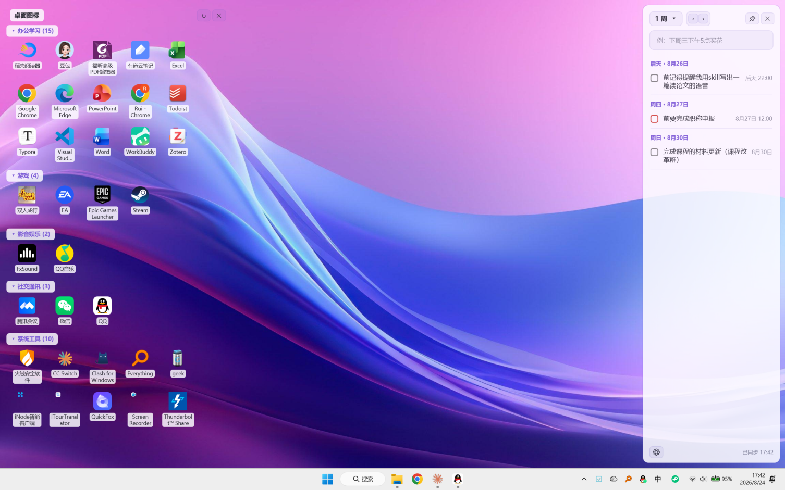
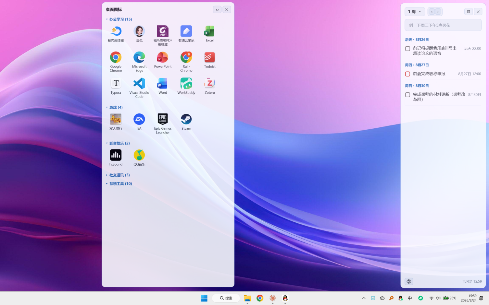
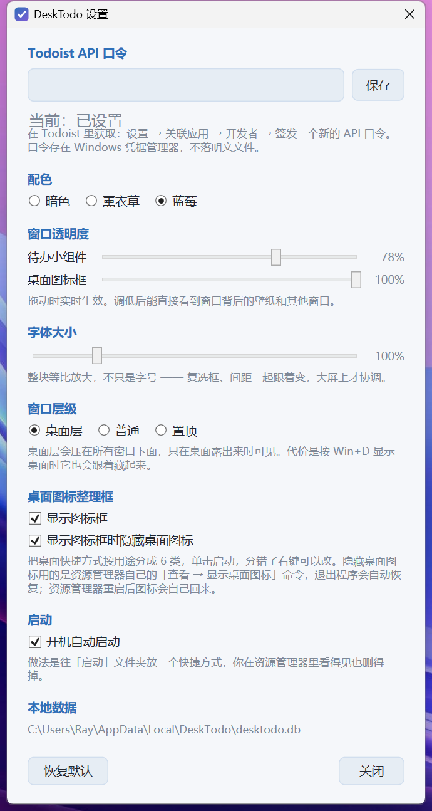

<div align="center">


# DeskTodo

**Windows 桌面上的常驻待办小组件 —— 和手机实时同步，不需要任何服务器**

[](../../releases/latest)
&nbsp;

&nbsp;




</div>

---

## 为什么做这个

我需要的东西很简单：**坐到电脑前，一眼就能看到今天要干什么** —— 不用打开任何 App，不用点任何图标。

但这件事在 Windows 上一直没有好的解法：

- **手机上记的事，到电脑前就忘了。** 待办 App 装了一堆，可它们都躺在任务栏里，不主动点开就等于不存在。
- **Windows 自带的小组件面板**要点一下才展开，而且没法自定义。
- **能常驻桌面的工具**，要么是纯本地的（换台电脑就没了），要么要按月订阅，要么得自己搭一个同步服务器。

最后一条是关键。市面上大部分"能同步"的桌面小工具，路线都是自建后端 —— 而这恰恰是最容易做砸的地方。

---

## 核心思路：把同步这件事，交给已经做好的人

**同步真正难的从来不是界面，是服务端。** 账号体系、跨端推送、冲突合并、可用性、数据安全，
任何一项做砸都是灾难：数据丢一次，用户就再也不会信任你。一个人做的小工具，
凭什么在这些事情上做得比专业团队好？

所以 DeskTodo 干脆**不做这一层**。

它把整个数据和同步层交给 **[Todoist](https://todoist.com)** —— 一个已经把
iOS / Android / Web / macOS / Windows 全平台、账号体系、离线合并都做完了十几年的成熟产品。
DeskTodo 只做一件事：**把你的待办，好好地呈现在 Windows 桌面上**，
通过 Todoist 官方 API 读写。

```
   你的手机 (Todoist App)  ─┐
   你的网页 (Todoist Web)  ─┼──►  Todoist 官方服务  ◄──►  DeskTodo（本工具）
   你的平板 (Todoist App)  ─┘                                    │
                                                          Windows 桌面
```

这个取舍换来的是：

| | |
|---|---|
| **零服务器** | 没有作者的后端。你的数据从不经过我手里，只在你的设备和你自己的 Todoist 账号之间流动 |
| **零运维** | 我哪天不维护了，你的数据一条都不会少 —— 它们本来就在你自己的 Todoist 账号里 |
| **零订阅** | 本工具永久免费，Todoist 免费版完全够用 |
| **真·多端** | 手机上加一条，电脑上一分钟内出现；电脑上勾掉，手机上立刻划线 |
| **随时可退** | 不想用了直接卸载。你的待办一条不少地留在 Todoist 里 |

**代价也说清楚**：你必须有一个 Todoist 账号（免费注册），并且愿意用它作为你的待办系统。
如果你想要一个完全自给自足、不依赖任何在线服务的本地待办，这个工具不适合你。

---

## 它长什么样

<table>
<tr>
<td width="50%" valign="top">

**桌面图标整理框**

桌面上几十个快捷方式，自动按用途分成 6 类。
可以顺带把原来乱糟糟的桌面图标藏起来。



</td>
<td width="50%" valign="top">

**设置**

配色、透明度、字体大小、窗口层级，都能调。



</td>
</tr>
</table>

---

## 功能

### 待办小组件

- **周期切换** —— 1 天 / 3 天 / 1 周 / 1 个月，跨多天时按日期分组
- **自然语言添加** —— 直接打「下周三下午5点买花 @生活 p1」，日期、标签、优先级由 Todoist 解析，
  和你在手机上打字的习惯完全一致
- **子任务进度** —— 显示 `0/2` 并可展开勾选
- **优先级配色** —— p1 红 / p2 橙 / p3 蓝，和 Todoist 保持一致
- **离线可用** —— 断网时勾选、删除照常操作，进队列排着，联网后自动补发
- **右键删除**，点标题回到今天

### 桌面图标整理框

- 扫描桌面快捷方式，按**软件用途**自动分成
  办公学习 / 游戏 / 影音娱乐 / 社交通讯 / 系统工具 / 其他
- 判断依据是目标路径、公司名和程序描述，不是简单按文件名猜
- **分错了右键改**，改一次永久记住
- 分类可折叠，**无卡片背景** —— 图标看着还是摆在桌面上，只是被分了组
- 可选：打开时自动隐藏真实桌面图标，关闭时恢复

### 外观

- **3 套配色**：蓝莓（默认）/ 薰衣草 / 暗色
- **透明度**：两个面板各自无级调节，调低能直接看到背后的壁纸
- **字体大小**：整块等比缩放，大屏上复选框和间距一起变，不会只有字变大
- **窗口层级**：桌面层（压在所有窗口下面，像壁纸的一部分）/ 普通 / 置顶
- 记住位置和尺寸，托盘常驻，可开机自启

---

## 安装

1. 到 [**Releases**](../../releases/latest) 下载 `DeskTodo-x.y.z-setup.exe`
2. 双击运行，默认装到 `C:\Program Files\DeskTodo`
3. 安装程序会**自动检测**你的电脑有没有 .NET 8 桌面运行时：
   - **已有** → 那一项自动取消勾选，不重复安装
   - **没有** → 默认勾上（运行时已打包在安装包内，不需要联网下载）

> **关于 SmartScreen**：安装包没有购买代码签名证书，从网页下载后首次运行
> Windows 可能提示「已保护你的电脑」。点「更多信息 → 仍要运行」即可。
> 这是所有未签名软件的通用行为，不代表有问题。

---

## 首次配置

装完第一次启动，会自动弹出设置窗口要一个 **Todoist API 口令**。拿法：

1. 打开 Todoist（桌面版或网页版）→ **设置** → **关联应用** → **开发者** 标签
2. 点「**签发一个新的 API 口令**」，复制
3. 粘贴进 DeskTodo 的设置窗口，点保存

口令存在 **Windows 凭据管理器**里（和你保存的网站密码同一个地方），不落任何明文文件。

> 启动后如果看不见窗口，是**正常的** —— 默认是「桌面层」，压在所有窗口下面。
> 按 <kbd>Win</kbd>+<kbd>D</kbd> 或最小化其他窗口就能看到；也可以在设置里改成「置顶」。
> 托盘图标里可以随时把两个面板叫出来。

---

## 隐私与数据

这是个闭源工具，所以更应该把数据流向讲清楚：

- **只和一个地方通信**：`api.todoist.com`。没有任何遥测、统计、崩溃上报
- **口令**存在 Windows 凭据管理器，DeskTodo 只在发请求时读它
- **任务数据**缓存在本地 `%LOCALAPPDATA%\DeskTodo\desktodo.db`（SQLite），
  界面只读这个本地库，所以断网照样能看能勾
- **桌面图标信息**（快捷方式名称、路径）**只在本机使用**，不会离开你的电脑
- **卸载不删**本地数据库和设置，重装可继续用；要彻底清理请手动删除上面那个目录

---

## 常见问题

**看不到窗口？**
默认是桌面层，压在所有窗口下面。按 <kbd>Win</kbd>+<kbd>D</kbd>，或托盘图标右键 → 勾选对应面板，
或在设置里把窗口层级改成「置顶」。

**桌面图标藏起来之后没恢复？**
正常退出（托盘 → 退出）会自动恢复。万一遇到异常退出，右键桌面 → **查看** → **显示桌面图标** 可以手动开回来。

**同步多久一次？**
默认 60 秒一轮，并且会自适应退避 —— 连续没变化就逐步拉长到最多 8 分钟，
一有操作立刻恢复。待办面板收起时完全暂停，不浪费流量。

**Todoist 免费版够用吗？**
日常个人使用完全够。免费版对活动项目数量有限制，但对任务数、多端同步、
本工具用到的全部 API 功能都没有限制。

**占多少资源？**
稳定后约 130 MB 内存，空闲时几乎没有网络请求。

---

## 已知限制

写在明面上，免得你装了才发现：

- **离线不能新建任务** —— 自然语言解析在 Todoist 服务端完成，断网时无法解析。
  勾选、删除这些操作是可以离线的
- **重复任务只读** —— 能正常显示和勾选，但不能在本工具里修改重复规则
- **桌面层模式下按 <kbd>Win</kbd>+<kbd>D</kbd> 会连它一起藏起来** ——
  它不是真正的壁纸层。介意的话切到「置顶」或「普通」
- **资源管理器重启后**，被隐藏的桌面图标会自己回来
- 目前只有中文界面
- 在 Windows 11 上开发和测试；Windows 10 应该能跑，但未经充分验证

---

## 系统要求

- Windows 10 (1809+) 或 Windows 11，64 位
- .NET 8 桌面运行时（**已打包在安装包内**，没有会自动安装）
- 一个 Todoist 账号（免费）

---

## 使用条款

免费软件，源代码不公开。详见 [LICENSE.md](LICENSE.md)。

**DeskTodo 与 Doist（Todoist 的开发商）没有任何隶属或合作关系**，
只是通过其公开 API 使用该服务。

---

<div align="center">

由 **RayZ** 开发 · 有问题欢迎提 [Issue](../../issues)

</div>
